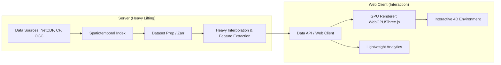

# Mermaid: Deep Dive Analysis

The **Mermaid** project (under SIH26067 Research) represents a paradigm shift in oceanographic data visualization. Instead of relying on traditional layer-based geospatial web tools, it proposes a **spatiotemporal 4D interactive environment** where the ocean itself serves as the interface. 

This deep dive synthesizes the core research concepts across the project's documentation to provide a comprehensive explanation of Mermaid's goals, methodologies, and architectural approach.

> [!NOTE]
> The primary thesis is **DATA → SPATIOTEMPORAL ALIGNMENT → INTERACTION → COMPARISON → DISCOVERY → INSIGHT**. The goal is to move beyond mere data access to immersive spatial interaction and model/observation fusion.

---

## 1. The Problem Space

Currently, numerical ocean models and observational data (Argo, Gliders, CTD, BGC) exist, but they are often analyzed separately or overlaid statically.
Traditional platforms (like *Copernicus MyOcean Pro* or *Ocean Data View*) excel at data access, providing 3D maps, layer sliders, and scientific profiles. However, they lack dynamic, context-aware fusion. 

Mermaid extends the baseline of **Model + Observation + 3D Rendering** by focusing on:
- **Spatiotemporal Co-location**: Aligning model predictions with observational truths in real-time.
- **Residual & Error Fields**: Focusing on the discrepancies ($E = Observation - Model$).
- **Uncertainty & Features**: Exposing uncertainty visually and enabling the tracking of emergent oceanic features.

## 2. Scientific Analytics Engine

Mermaid doesn't just display data; it computes and compares it. 
* **Residual Analysis**: Calculating the difference between observation $O(x,y,z,t)$ and model $M(x,y,z,t)$ to understand where reality diverges from predictions.
* **Feature Extraction**: Identifying eddies, fronts, upwellings, and blooms using scientific methods (gradients, vorticity, Okubo-Weiss).
* **Trajectory Analysis**: Sampling model data along the real-world 4D trajectory of an observational float.
* **Temporal Tracking**: Following features from birth through movement, growth, and decay, representing state changes and associated uncertainties.

> [!WARNING]
> The research explicitly dictates an AI policy: **Use AI only when it adds measurable value** (e.g., feature classification, forecasting). AI must not be used merely as decoration.

## 3. Novel Interaction Patterns

Mermaid proposes a highly interactive, progressive disclosure approach to ocean data:

1. **Ocean as Canvas**: The environment is full-screen, with controls appearing contextually rather than cluttering the screen in static sidebars.
2. **Camera as Analytical Scale**: Navigating through scales—Global → Region → Feature → Observation—is the primary method of filtering.
3. **Observation as Query Primitive**: Selecting a specific float or sensor automatically constructs and visualizes its localized model context.
4. **Residual-First Mode**: A specialized interaction mode that visually highlights *only* the errors and anomalies, rather than the raw data.
5. **Feature as Object**: Emergent phenomena (like a specific eddy) become selectable, interactable objects with their own contextual panels.

## 4. System Architecture

To achieve high-performance 4D interaction and on-the-fly analytics, Mermaid proposes a hybrid architectural split:

* **Backend Stack**: FastAPI, Object Storage, Scientific Data API. Leveraging Python, xarray, Dask, and Zarr for heavy dataset processing.
* **Frontend Stack**: React/Next.js combined with modern 3D rendering (WebGPU, Three.js, CesiumJS).
* **Division of Labor**: The server handles heavy interpolation and extraction, while the browser manages interaction, rendering, and selected real-time numerical operations.

## 5. Core Research Questions to Validate

The project identifies several critical paths for future validation:
* **UX/UI**: Can spatial navigation genuinely replace layer-first workflows? How much information should be progressively disclosed?
* **Scientific Accuracy**: What is the correct model-observation co-location method? Which ocean features can be robustly detected?
* **Visualization**: Which visual encoding best communicates residuals and uncertainty?
* **Performance**: What data representation provides the best random access? How should workload be balanced between GPU and server?

---

> [!TIP]
> **Implications for Development**
> Building Mermaid requires treating the visual application not as a dashboard, but as a scientific instrument. Every visual choice (opacity, texture, camera movement) must carry scientific meaning and serve the ultimate goal of data discovery.
